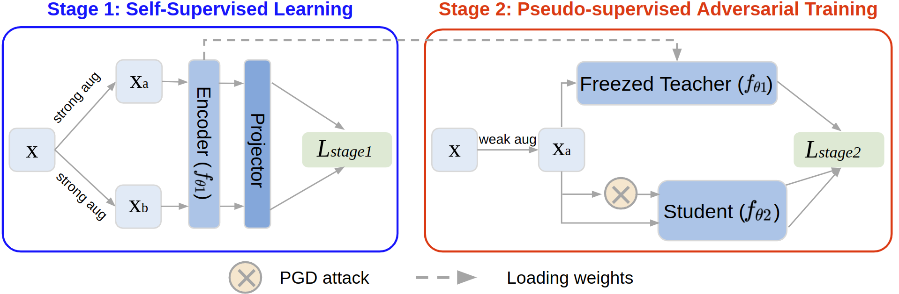

# Decoupled Adversarial Contrastive Learning for Self-supervised Adversarial Robustness (Accepted by ECCV2022 oral presentation)

Chaoning Zhang, Kang Zhang, Chenshuang Zhang, Axi Niu, Jiu Feng, Chang D. Yoo, In So Kweon


Overall framework of DeACL. It consists of two stages. At stage 1, DeACL performs a standard SSL to obtain a non-robust encoder. At stage 2, the pretrained encoder act as a teacher model to generate pseudo-targets for guiding a supervised AT on a student model. After two stages of training, the student model is the model of our interest.


---
See also our other works:

Dual Temperature Helps Contrastive Learning Without Many Negative Samples: Towards Understanding and Simplifying MoCo (Accepted by CVPR2022) [code](https://github.com/ChaoningZhang/Dual-temperature.git) [paper](https://arxiv.org/abs/2203.17248)

---

# Change log
*2023.3.2* The different definitions of the Resnet model between pre-train and SLF make the forward and backward different. Our previous code can get a different result given in the paper. We fixed the bug by changing the Resnet used during the SLF setting and released the pre-trained model with new code, which performs slightly differently from the one reported in the paper (SLF with CIFAR10 (AA,RA,SA) reported in paper: `45.31, 53.95, 80.17` -> with current code: `45.57, 55.43, 79.53`). (We apologize for not providing the model used in the paper since we accidentally deleted the original file.)

# 🔧 Enviroment
we use docker `nvidia/cuda:10.2-cudnn8-devel-ubuntu18.04`. And we only tested on this docker enviroment.

We use [conda](https://docs.conda.io/en/latest/miniconda.html) for python enviroment management. After installing conda,

1. conda create -n deacl python=3.8

2. conda activate deacl

2. pip install -r requirements.txt


# ⚡ Training

## 1. prepare the pretrained teacher self-supervised model
You can download pretrained checkpoint from [solo-learn](https://github.com/vturrisi/solo-learn#cifar-10) or train by yourself. 

SimCLR model pretrained by solo-learn [link](https://drive.google.com/drive/folders/1mcvWr8P2WNJZ7TVpdLHA_Q91q4VK3y8O?usp=sharing).

put the downloaded model into folder 'TeacherCKPT'

## 2. Train DeACL with ResNet18 on CIFAR10 dataset

Using the file `bash_files\DeACL_cifar10_resnet18.sh`. You need to specific the `--project xxx`, `--entity xxx`, and add `--wandb` to enable wandb logging.

## 3. Test the robustness of PGD and AutoAttack with full precision 
First install [autoattack](https://github.com/fra31/auto-attack) package `pip install git+https://github.com/fra31/auto-attack`

We privide our pretrained model on CIFAR10 with teacher model SimCLR at [here](https://drive.google.com/file/d/1yc38miWGY57sHS6W6aY_k5t69Gt5v5fm/view?usp=sharing).

`python adv_slf.py --ckpt CKPT_PATH`

This code is developed based on [solo-learn](https://github.com/vturrisi/solo-learn) for training and [AdvCL](https://github.com/LijieFan/AdvCL.git) for testing.

<!-- # Citation
```
@article{zhang2022dual,
  title={Dual temperature helps contrastive learning without many negative samples: Towards understanding and simplifying moco},
  author={Zhang, Chaoning and Zhang, Kang and Pham, Trung X and Niu, Axi and Qiao, Zhinan and Yoo, Chang D and Kweon, In So},
  journal={CVPR},
  year={2022}
}
``` -->

# Citation
```
@inproceedings{zhang2022decoupled,
  title={Decoupled Adversarial Contrastive Learning for Self-supervised Adversarial Robustness},
  author={Zhang, Chaoning and Zhang, Kang and Zhang, Chenshuang and Niu, Axi and Feng, Jiu and Yoo, Chang D and Kweon, In So},
  booktitle={ECCV 2022},
  pages={725--742},
  year={2022},
  organization={Springer}
}
```
